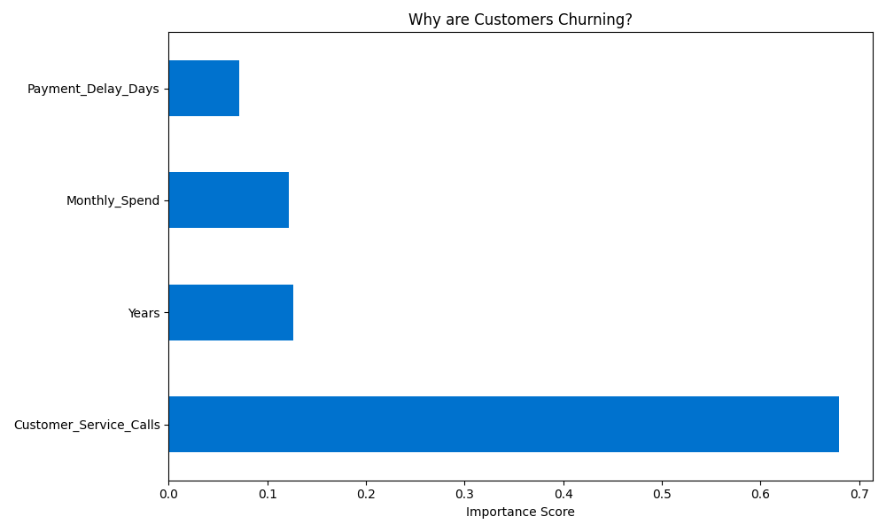

# Customer Churn Prediction

## Business Case: Predictive Retention
In the financial services industry, retaining an existing customer is significantly more cost-effective than acquiring a new one. This project leverages **Machine Learning** to identify "at-risk" customers before they churn, enabling data-driven proactive retention strategies.

## Project Overview
- **Objective**: Predict customer churn (account closure) based on historical behavior.
- **Model**: Random Forest Classifier (Ensemble Learning).
- **Data**: 1,000 simulated customer profiles including spending habits, tenure, and support interactions.

## Model Performance
The model achieved an **Accuracy of 86.5%** on the test dataset.

### Key Drivers of Churn (Feature Importance)
The model identified the following variables as the strongest indicators of churn:
1. **Customer Service Calls**: High interaction frequency correlates strongly with dissatisfaction and imminent churn.
2. **Account Tenure**: Newer customers (1-3 years) exhibit higher volatility compared to long-term members.
3. **Monthly Spend**: A declining trend in transaction volume serves as a leading indicator of account abandonment.

## Business Impact & Strategy
By accurately identifying **86.5% of at-risk customers**, the following proactive measures can be implemented:
* **High-Priority Intervention**: Customers exceeding a threshold of support calls are automatically routed to a specialized retention team.
* **Targeted Incentives**: Deploying annual fee waivers or loyalty point multipliers for "High Risk" but "High Value" segments.
* **Lifecycle Marketing**: Automated engagement campaigns for customers in their first 24 months to increase brand stickiness.

## Technical Stack
- **Language**: Python (Pandas, Scikit-Learn)
- **Visualization**: Matplotlib, Seaborn
- **Workflow**: Git/GitHub for version control